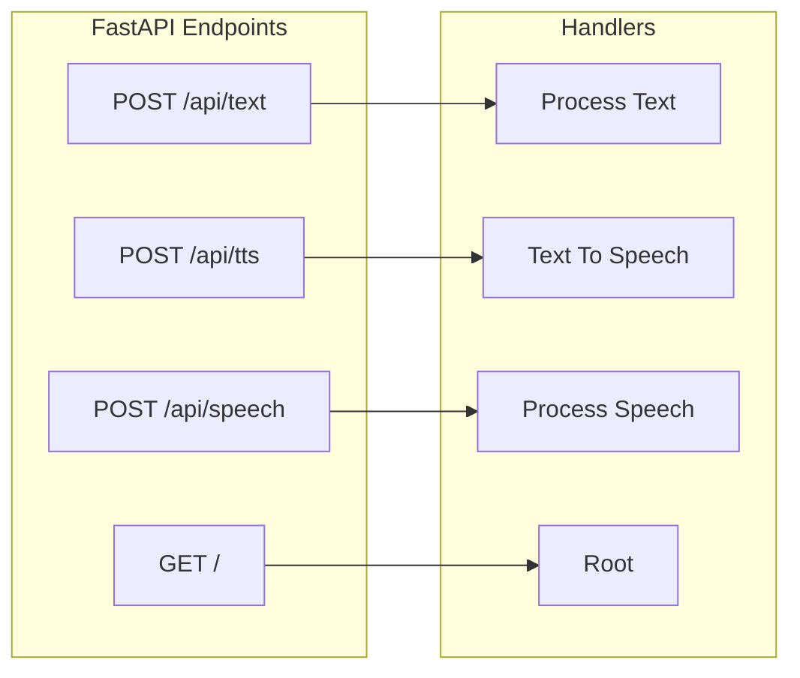
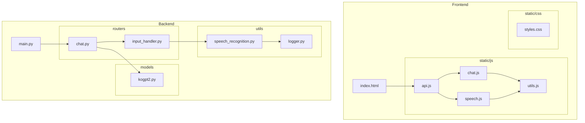
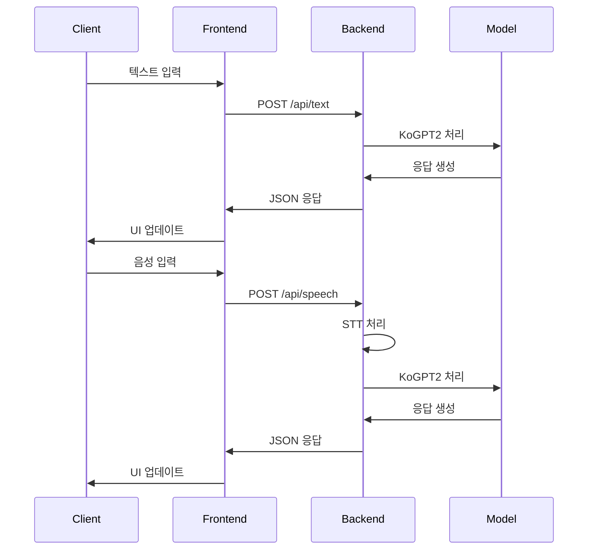

# 근감소증 상담 챗봇 프로젝트

## 프로젝트 개요
근감소증 환자들을 위한 AI 기반 상담 챗봇 시스템입니다. 음성 인식을 지원하여 자연스러운 대화 방식으로 상담이 가능합니다.

## 프로젝트 구조
```
Sarcopenia_KoGPT2/
├── app/                   # 메인 애플리케이션 디렉토리
│   ├── models/           # 모델 관련 파일
│   │   └── kogpt2.py    # KoGPT2 모델 구현
│   ├── routers/          # API 라우터
│   │   ├── chat.py      # 채팅 관련 라우터
│   │   └── input_handler.py  # 입력 처리
│   ├── train/           # 학습 관련 파일
│   │   └── train.py     # 모델 학습 스크립트
│   └── utils/           # 유틸리티 파일
│       ├── logger.py    # 로깅 시스템
│       └── speech_recognition.py  # 음성 인식 처리
├── config/              # 설정 파일 디렉토리
├── data/               # 데이터 파일
│   ├── sarcopenia_structured_training.json
│   └── test_dataset.csv
├── docs/               # 문서 디렉토리
│   ├── README.md      # 메인 문서
│   ├── model_select.md
│   ├── stt.md
│   ├── training_results.md
│   └── tts.md
├── frontend/          # 프론트엔드 디렉토리
│   ├── static/       # 정적 파일
│   │   ├── css/     # CSS 파일
│   │   │   └── styles.css
│   │   ├── images/  # 이미지 파일
│   │   └── js/      # JavaScript 파일
│   │       ├── api.js
│   │       ├── chat.js
│   │       ├── speech.js
│   │       └── utils.js
│   └── index.html   # 메인 HTML 파일
├── models/           # 학습된 모델 파일
│   └── fine_tuned_model/
│       ├── config.json
│       ├── pytorch_model.bin
│       └── [기타 모델 파일들]
├── output/           # 출력 파일
│   └── Enriched_Conversation_Based_Prompt_DB_20250110/
│       ├── Prompt_Diagnosis.csv
│       ├── Prompt_Information.csv
│       ├── Prompt_Prevention.csv
│       └── Prompt_Study.csv
├── sarcopenia_model/ # 학습 체크포인트
│   ├── checkpoint-500/
│   ├── checkpoint-600/
│   └── [기타 모델 파일들]
├── tests/           # 테스트 파일
│   ├── test_api.py
│   ├── test_speech.py
│   └── test_text.py
├── Dockerfile      # Docker 설정
├── requirements.txt # Python 의존성
├── train_Kogpt2.py # 모델 학습 스크립트
└── xlsx2csv.py     # 데이터 변환 스크립트
```

## 주요 파일 설명

### 백엔드 (app/)

#### models/
- **kogpt2.py**: KoGPT2 모델 클래스 및 추론 로직
- **input_handler.py**: 사용자 입력 전처리 및 검증

#### routers/
- **chat.py**: 텍스트 채팅 API 엔드포인트
- **speech.py**: 음성 인식/처리 API 엔드포인트

#### utils/
- **audio.py**: 음성 파일 처리, 포맷 변환
- **text.py**: 텍스트 정규화, 전처리

### 프론트엔드 (frontend/)

#### static/js/
- **api.js**: 백엔드 API 통신 클래스 및 메서드
- **chat.js**: 채팅 UI 관리 및 메시지 처리
- **audio.js**: 음성 녹음 및 재생 관리
- **handlers.js**: 이벤트 핸들러 (마이크, 폼 제출 등)
- **utils.js**: 공통 유틸리티 함수

#### static/css/
- **styles.css**: 전역 스타일 정의
- **chat.css**: 채팅 인터페이스 스타일

## 설치 및 실행

### 프론트엔드
```bash
cd frontend
python -m http.server 3000
```

### 백엔드
```bash
pip install -r requirements.txt
uvicorn app.main:app --reload
```

## API 문서
- Swagger UI: `http://localhost:8000/docs`
- ReDoc: `http://localhost:8000/redoc`

## 기술 스택
- **프론트엔드**: HTML5, CSS3, JavaScript
- **백엔드**: FastAPI, Python 3.8+
- **AI 모델**: KoGPT2
- **기타**: Bootstrap 5, WebRTC

## 상세 기능 설명

### 프론트엔드 핵심 기능 (frontend/static/js/api.js)

#### 1. API 서비스 클래스
```javascript
class ApiService {
    constructor() {
        this.baseUrl = 'http://localhost:8000/api';
    }
    
    async sendTextMessage(text) { ... }
    async sendAudioMessage(audioBlob) { ... }
}
```
- 모든 API 통신 관리
- 텍스트/음성 메시지 처리
- 에러 핸들링

#### 2. 입력 핸들러
```javascript
async function handleTextInput(text) { ... }
async function handleSpeechInput(audioBlob) { ... }
```
- 텍스트 입력 처리
- 음성 입력 변환 및 처리
- 채팅 UI 업데이트

#### 3. 음성 녹음 관리
```javascript
async function handleMicButton() { ... }
function updateMicButtonUI(isRecording) { ... }
```
- 마이크 접근 및 녹음
- 녹음 상태 UI 관리
- 오디오 데이터 수집

#### 4. 채팅 표시
```javascript
function displayResponse(text, isUser = false) { ... }
```
- 사용자/봇 메시지 구분 표시
- 자동 스크롤
- 메시지 스타일링

### 백엔드 API 엔드포인트 (app/routers/chat.py)

#### 1. 텍스트 채팅 엔드포인트
```python
@router.post("/api/text")
async def process_text(request: TextRequest):
```
- **기능**: 텍스트 기반 대화 처리
- **요청 형식**:
  ```json
  {
    "text": "사용자 입력 텍스트"
  }
  ```
- **응답 형식**:
  ```json
  {
    "response": "챗봇 응답 텍스트",
    "status": "success"
  }
  ```
- **에러 응답**:
  ```json
  {
    "error": "에러 메시지",
    "status": "error"
  }
  ```
- **처리 과정**:
  1. 입력 텍스트 유효성 검사
  2. 텍스트 전처리 (정규화, 특수문자 처리)
  3. KoGPT2 모델을 통한 응답 생성
  4. 응답 후처리 및 반환

#### 2. 음성 처리 엔드포인트
```python
@router.post("/api/speech")
async def process_speech(audio_file: UploadFile):
```
- **기능**: 음성 입력을 텍스트로 변환 후 대화 처리
- **요청 형식**: 
  - Content-Type: multipart/form-data
  - audio_file: 음성 파일 (MP3/WAV)
- **응답 형식**:
  ```json
  {
    "recognized_text": "변환된 텍스트",
    "response": "챗봇 응답 텍스트",
    "status": "success"
  }
  ```
- **에러 응답**:
  ```json
  {
    "error": "에러 메시지",
    "status": "error"
  }
  ```
- **처리 과정**:
  1. 음성 파일 유효성 검사
  2. 음성을 텍스트로 변환 (STT)
  3. 변환된 텍스트 전처리
  4. KoGPT2 모델을 통한 응답 생성
  5. 응답 생성 및 반환

#### 공통 기능
- **인증**: 현재는 별도의 인증 없음
- **요청 제한**: 
  - 최대 음성 파일 크기: 10MB
  - 최대 텍스트 길이: 200자
- **응답 시간**: 
  - 텍스트 처리: 평균 1-2초
  - 음성 처리: 평균 3-5초
- **에러 처리**:
  - 입력 형식 오류
  - 파일 크기 초과
  - 모델 처리 실패
  - 서버 내부 오류

#### 개발 참고사항
- FastAPI의 자동 문서화 지원 (/docs, /redoc)
- CORS 설정 적용됨
- 비동기 처리로 구현
- 모든 응답에 HTTP 상태 코드 포함

## 데이터 흐름

### 1. 텍스트 입력 프로세스
1. 사용자 텍스트 입력
2. `handleTextInput()` 호출
3. `ApiService.sendTextMessage()` 실행
4. 백엔드 API 호출
5. KoGPT2 모델 처리
6. 응답 수신 및 표시

### 2. 음성 입력 프로세스
1. 마이크 버튼 클릭
2. `handleMicButton()` 실행
3. 음성 녹음 시작
4. 녹음 종료 시 `handleSpeechInput()` 호출
5. `ApiService.sendAudioMessage()` 실행
6. 백엔드 음성 처리
7. 텍스트 변환 및 응답 생성
8. UI 업데이트

## 에러 처리
1. API 통신 에러
2. 마이크 접근 오류
3. 음성 인식 실패
4. 모델 처리 오류

## 시스템 다이어그램

### 1. API 엔드포인트


### 2. 파일 구조 및 의존성


### 3. 데이터 흐름도


## 주요 컴포넌트 설명

### Frontend 파일
- **index.html**: 메인 웹 인터페이스
- **api.js**: API 통신 및 데이터 처리
- **chat.js**: 채팅 UI 및 메시지 관리
- **speech.js**: 음성 입력/출력 처리
- **utils.js**: 유틸리티 함수
- **styles.css**: UI 스타일링

### Backend 파일
- **main.py**: FastAPI 서버 설정 및 초기화
- **routers/chat.py**: 채팅 관련 API 라우트
- **routers/input_handler.py**: 입력 처리 로직
- **models/kogpt2.py**: KoGPT2 모델 구현
- **utils/speech_recognition.py**: 음성 인식 처리
- **utils/logger.py**: 로깅 시스템

## API 엔드포인트 상세

### POST /api/text
- 텍스트 기반 대화 처리
- 요청/응답: JSON

### POST /api/tts
- 텍스트를 음성으로 변환
- 응답: 오디오 파일

### POST /api/speech
- 음성을 텍스트로 변환 후 대화 처리
- 요청: 음성 파일
- 응답: JSON

### GET /
- 루트 경로
- 기본 페이지 제공
